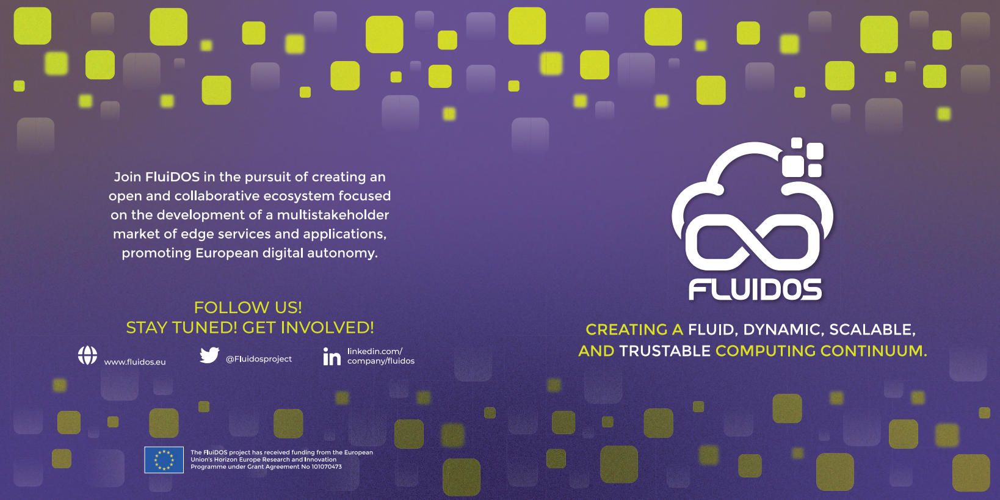
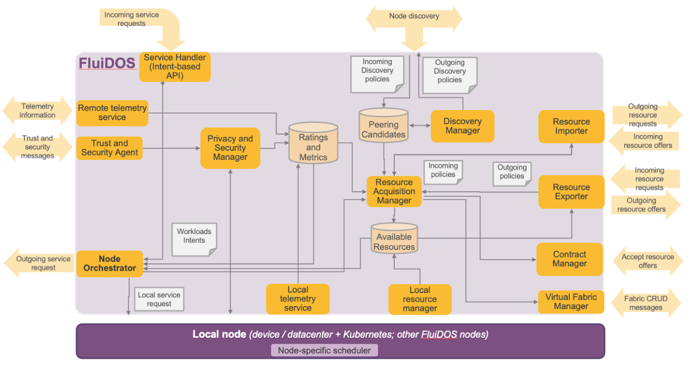

  <a href="#bulb-about">About</a> &nbsp;&bull;&nbsp;
  <a href="#classical_building-the-fluidos-architecture">The Fluidos Architecture</a> &nbsp;&bull;&nbsp;
  <a href="#computer-click-and-play-playground">Click-and-play playground</a> &nbsp;&bull;&nbsp;
  <a href="#mag_right-research">Research</a> &nbsp;&bull;&nbsp;
  <a href="#toolbox-tech-stack">Tech Stack</a> &nbsp;&bull;&nbsp;
  <a href="#book-references-and-resources">Resources</a>

 

|Service|Command Stack|
|---------------|:----------------------------------------------------------------------------------------------------------------------------------------------------------------------------------------------------------------------------------------:
| Node build      |          
| Node Artifacts     |          
| Node Helm Docs     |          
| Node Linting    |          
| Node Build Deployment    |          

 :construction: Work in Progress (WIP)

## :bulb: About

The IT landscape has evolved into a world of hyperconnectivity, where devices and information systems communicate and exchange data on numerous applications. FLUIDOS will leverage the enormous, unused processing capacity at the edge, scattered across heterogeneous edge devices that struggle to integrate with each other and to form a seamless computing continuum coherently.

### :star: Give a Star!

Support this research by **giving it a star**. Thanks!

## Documentation

The most up-to-date documentation about the project, the overall architecture, and the current implementation of the components is available in the [Docs](https://github.com/fluidos-project/Docs) repository.

## :classical_building: The Fluidos Architecture

### Fluidos Node

## :desktop_computer: Software components

### Currently available components

    
 FLUIDOS Node 

- A component that can consist of either a single device or a set of devices, primarily serving as a representation of a Kubernetes node. It is managed by a singular Kubernetes Control Plane. For additional information, kindly consult the [FLUIDOS node repository](https://github.com/fluidos-project/node)

    
 FLUIDOS at the edge

- FLUIDOS at the edge: a minimal architecture for running the FLUIDOS components at the edge of the network on some STM boards, leveraging KubeEdge.

    
 FLUIDOS MetaOrchestration

- FLUIDOS meta-orchestration:
    This component provides functionality to perform intent-based meta orchestration of workloads within FLUIDOS continuum.
    The component relies on the functionality provided by the FLUIDOS node (see above) to perform resource discovery and acquisition.
    The project itself is extensible, allowing the definition of specific models, or rule/heuristics, for the orchestration of the deployed workloads.
    For additional information, kindly consult the [FLUIDOS model-based Meta Orchestration repository](https://github.com/fluidos-project/fluidos-modelbased-metaorchestrator/).

    
 kubectl FLUIDOS plugin

- kubectl FLUIDOS plugin:
    This project provides an extension (plugin) to kubectl to seamlessly interact with FLUIDOS components, namely meta-orchestrator(s).
    The project is developed using Python, and it acts as a bridge between traditional kubernetes requests and the one processed by the model-based meta orchestrator.
    Note that the pluging also allows interaction with the MSPL-based meta-orchestrator, thus providing a developer a single tool for transparently interacting with the FLUIDOS components.
    For additional information, kindly consult the [kubectl FLUIDOS plugin](https://github.com/fluidos-project/kubectl-fluidos-plugin/).

    
 Fluidos Identity Management

- Fluidos Identity Management:
    This component consists in an Aries agent modified for use dp-abc cryptography combined with Hyperledger Fabric as VDR to provide a very powerful interface when working with DID's, issuing VCredentials or using smart contracts. 
    These tools will help to secure any scenario that may occur in FLUIDOS and bring us an API with which we can, among other things; issue VCredentials, create DIDs for FLUIDS entities, create Verifiable Presentations from VCredentials and verify said VCredentials/VPresentations.For additional information, kindly consult the [Fluidos Identity Management Aries Framework](https://github.com/fluidos-project/idm-fluidos-aries-framework-go).

### Current standalone components

    
 Cyber Deception 

- A component to provide Cloud Native Cyber Deception as a service, thus enhancing the overall security of the FLUIDOS ecosystem. For additional information, check the [Cyber Deception repository](https://github.com/fluidos-project/cyber-deception).

## :computer: Click-and-play playground
This section summarizes the basic steps to reach a minimal setup of the available FLUIDOS components.

    
 Fluidos Node 

### Fluidos Node

- You can set up a FLUIDOS Node testbed using KIND (Kubernetes in Docker), which represents the simplest method to install this software on your local machine. [Begin your journey here.](https://github.com/fluidos-project/node/tree/main/testbed/kind).

    
 Fluidos at the edge 

### Fluidos at the edge

- A minimal architecture for running the FLUIDOS components at the edge of the network on some STM boards, leveraging KubeEdge.

    
 Fluidos Identity Management

### Fluidos Identity Management:
    To build a functional demo of the component, check the following guide [Fluidos Identity Management Guideline](https://github.com/fluidos-project/idm-fluidos-aries-framework-go/blob/main/README.md).

## :world_map: Roadmap
